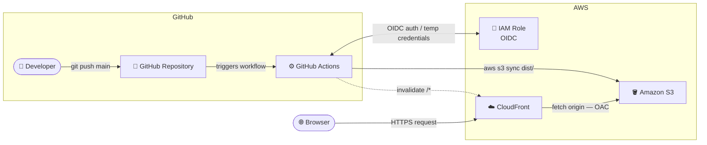

# Cloud Academy – React Marketing Site

A production-ready deployment of a React + TypeScript marketing site on AWS, provisioned with Terraform and deployed automatically via GitHub Actions on every push to `main`.

---

## Architecture



> The full editable diagram is available at [`architecture.drawio`](./architecture.drawio).

**Deployment Flow** — A push to `main` triggers GitHub Actions, which authenticates to AWS via OIDC, syncs the built app to S3, then invalidates the CloudFront cache.

**User Request Flow** — End users hit the CloudFront distribution over HTTPS. CloudFront fetches content from S3 using a signed OAC request and serves it from the nearest edge location.

---

## AWS Components

### Amazon S3
Stores the compiled React application (`dist/`) as static files. The bucket is fully private — no public access is permitted at any level. Only CloudFront can read from it, enforced by the bucket policy.

Versioning is enabled so every deployment retains the previous version of each file, making rollbacks possible without re-running the pipeline.

### Amazon CloudFront
Serves the site globally from AWS edge locations, providing low latency, HTTPS termination, and HTTP → HTTPS redirects. It is the only public entry point to the application.

Custom error responses map S3's `403` and `404` codes back to `index.html` with a `200` status, enabling client-side routing (React Router) to work correctly on direct URL access and page refresh.

### AWS IAM — OIDC Identity Provider & Role
Allows GitHub Actions to authenticate to AWS without storing long-lived access keys anywhere. GitHub generates a short-lived OIDC token per workflow run; AWS verifies it against the registered identity provider and returns temporary credentials scoped to that run only.

The IAM role's trust policy is locked to a specific GitHub repository and branch, so no other repository can assume it.

### Origin Access Control (OAC)
A CloudFront-native credential that signs every request to S3 using AWS Signature Version 4. S3 validates the signature before serving any object. This replaces the legacy Origin Access Identity (OAI) pattern.

---

## Deployment Instructions

### Prerequisites

- [Terraform](https://developer.hashicorp.com/terraform/install) >= 1.0
- [AWS CLI](https://aws.amazon.com/cli/) configured with sufficient permissions
- A GitHub repository with Actions enabled

### 1. Provision infrastructure

```bash
cd terraform
terraform init
terraform apply
```

When prompted, enter your GitHub repository in `owner/repo` format:

```
var.github_repository
  GitHub repository in owner/name format

  Enter a value: HarelValfish/react-cicd-terraform
```

Alternatively, create `terraform/terraform.tfvars` to avoid the prompt:

```hcl
github_repository = "HarelValfish/react-cicd-terraform"
```

### 2. Copy Terraform outputs

After `apply` completes, note the output values:

```bash
terraform output
```

| Output | Used for |
|---|---|
| `github_actions_role_arn` | GitHub secret `AWS_ROLE_ARN` |
| `bucket_name` | GitHub secret `S3_BUCKET_NAME` |
| `cloudfront_distribution_id` | GitHub secret `CLOUDFRONT_DISTRIBUTION_ID` |

### 3. Add GitHub Secrets

In your repository go to **Settings → Secrets and variables → Actions** and add:

| Secret name | Value |
|---|---|
| `AWS_ROLE_ARN` | `github_actions_role_arn` output |
| `S3_BUCKET_NAME` | `bucket_name` output |
| `CLOUDFRONT_DISTRIBUTION_ID` | `cloudfront_distribution_id` output |

### 4. Deploy

Push to `main` — the pipeline runs automatically:

```bash
git push origin main
```

Monitor progress in the **Actions** tab. On completion the site is live.

---

## Website URL

**[https://d2hpzcdu7ook5e.cloudfront.net](https://d2hpzcdu7ook5e.cloudfront.net)**

---

## Repository Structure

```
.
├── .github/
│   └── workflows/
│       └── deploy.yaml       # CI/CD pipeline
├── src/                      # React application source
├── terraform/
│   ├── main.tf               # Provider configuration
│   ├── variables.tf          # Input variables
│   ├── s3.tf                 # S3 bucket, versioning, policy
│   ├── cloudfront.tf         # OAC and CloudFront distribution
│   ├── iam.tf                # OIDC provider and IAM role
│   └── outputs.tf            # Exported values
├── architecture.drawio       # Editable architecture diagram
└── README.md
```
